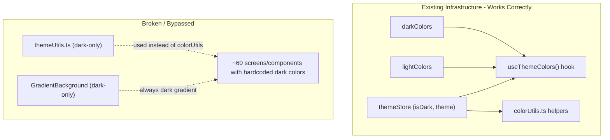

# Fix Light Mode Across GoFit Mobile

## Design Direction: Premium Mirrored Glass Aesthetic

Light mode should feel just as premium as dark mode -- not a flat white downgrade. The same glass, glow, and gradient language is preserved but inverted:

| Element | Dark Mode (current) | Light Mode (target) |

|---|---|---|

| **Background gradient** | `#0B120B` -> `#050505` -> `#000` | `#F8FAF5` -> `#F2F5EE` -> `#FAFBFC` (warm white with green undertone) |

| **Green glow overlays** | `rgba(132, 196, 65, 0.08)` | `rgba(132, 196, 65, 0.06)` (subtler on light) |

| **Glass surfaces (cards)** | `rgba(255, 255, 255, 0.05)` with light blur | `rgba(255, 255, 255, 0.7)` with stronger blur + soft shadow |

| **Glass borders** | `rgba(255, 255, 255, 0.1)` | `rgba(0, 0, 0, 0.06)` |

| **Text primary** | `#FFFFFF` | `#1A1D21` |

| **Text secondary** | `rgba(255, 255, 255, 0.7)` | `#5A6570` |

| **Green accent glow** | Green shadow/textShadow on dark | Green shadow on frosted white surface |

| **Blur tint** | `tint="dark"` | `tint="light"` |

| **FAB / floating elements** | Dark glass `rgba(20,20,20,0.6)` | Frosted white glass `rgba(255,255,255,0.8)` with shadow |

| **Shadows** | Minimal (dark absorbs) | Stronger, more defined (light needs depth cues) |

| **Active tab indicator** | Green glow on dark pill | Green glow on frosted white pill |

**Key principle**: Every glass/blur/glow effect gets a light-mode twin. No flat white surfaces -- always frosted, always with subtle green energy.

**Auth and Onboarding stay dark-only** -- branded experience regardless of theme setting.

## Root Cause Analysis

The app has proper theme infrastructure that is severely underused:

- **`useThemeColors()`** hook correctly returns `lightColors` or `darkColors` -- but most files never call it
- **`colorUtils.ts`** has theme-aware helpers like `getBackgroundColor(isDark)`, `getTextColor(isDark)` -- but many screens import from the dark-only `themeUtils.ts` instead
- **`GradientBackground`** is hardcoded to dark gradients (`#0B120B` -> `#000000`) with no `isDark` support -- used by 12 profile/settings screens
- **`themeUtils.ts`** is entirely dark-mode only (backgrounds: `#030303`, `#1a1a1a`; text: `#FFFFFF`) -- used by `HomeScreen`, `HomeHeader`, `LibraryScreen`, etc.

### Scale of the problem

- **~60 files** with hardcoded dark background colors (`#030303`, `#000000`, `#1a1a1a`)
- **~70 files** with hardcoded `rgba(255, 255, 255, ...)` for text/borders/overlays
- **~50 files** with hardcoded `color: '#ffffff'` for text
- **`HomeScreen`** does not use `isDark` at all
- **8 home components** barely use `isDark`

## Fix Strategy: Foundation First, Then Propagate

### Phase 1: Fix Shared Foundations (4 files)

These changes automatically fix every screen that uses them.

**1a. Make `GradientBackground` theme-aware** -- [GradientBackground.tsx](GoFitMobile/src/components/shared/GradientBackground.tsx)

- Import `useThemeStore` and read `isDark`
- Dark mode: keep current dark gradients (`#0B120B` -> `#050505` -> `#000000`) + green haze
- Light mode: warm white gradient (`#F8FAF5` -> `#F2F5EE` -> `#FAFBFC`) with subtle green-tinted top haze (`rgba(132, 196, 65, 0.04)`) -- keeps the organic/premium feel, not flat white
- Container fallback: dark `#000` vs light `#FAFBFC`
- This alone fixes 12 profile/settings screens that wrap everything in `<GradientBackground>`

**1b. Delete `themeUtils.ts` and expand `colorUtils.ts`** -- [themeUtils.ts](GoFitMobile/src/utils/themeUtils.ts) / [colorUtils.ts](GoFitMobile/src/utils/colorUtils.ts)

- Delete `themeUtils.ts` entirely (dark-only, unfixable design)
- Migrate its 7 consumers (`HomeScreen`, `HomeHeader`, `LibraryScreen`, `EmptyState`, `RouteErrorBoundary`, `AnimatedBackground`, plus `ErrorState`) to use `colorUtils.ts`
- Add new helpers to `colorUtils.ts` for the premium glass aesthetic:
  - `getGlassBg(isDark)` -- returns glass surface color (`rgba(255,255,255,0.05)` dark / `rgba(255,255,255,0.7)` light)
  - `getGlassBorder(isDark)` -- returns glass border (`rgba(255,255,255,0.1)` dark / `rgba(0,0,0,0.06)` light)
  - `getOverlayColor(isDark, opacity)` -- returns `rgba(255,255,255,op)` dark / `rgba(0,0,0,op)` light
  - `getBlurTint(isDark)` -- returns `"dark"` or `"light"` for BlurView

**1c. Fix `AppNavigator` screen options** -- [AppNavigator.tsx](GoFitMobile/src/navigation/AppNavigator.tsx)

- Currently hardcodes `backgroundColor: '#030303'` and `headerTintColor: '#FFFFFF'`
- Make these dynamic using `useThemeStore` + `colorUtils` helpers

**1d. Fix `CustomDialog`** -- [CustomDialog.tsx](GoFitMobile/src/components/shared/CustomDialog.tsx)

- Has hardcoded dark backgrounds and white text in its global modal

### Phase 2: Fix Screens by Tab (grouped by navigation stack)

Work through each tab's screens. The pattern for each file:

1. Import `useThemeStore` (if not already) to get `isDark`
2. Import from `colorUtils.ts` or use `useThemeColors()` hook
3. Replace hardcoded dark backgrounds -> `getBackgroundColor(isDark)`
4. Replace hardcoded white text -> `getTextColor(isDark)`
5. Replace `rgba(255, 255, 255, X)` borders/overlays -> `getTextColorWithOpacity(isDark, X)` or `getBorderColor(isDark)`
6. Replace `rgba(3, 3, 3, X)` overlays -> light mode equivalent (inverted opacity on black/white)
7. **Glass surfaces**: dark `rgba(255,255,255,0.05)` -> light `rgba(255,255,255,0.7)` with added shadow from `getShadow(isDark)`
8. **BlurView tint**: `tint={isDark ? "dark" : "light"}`
9. **Green glows/shadows**: slightly lower opacity in light mode (light backgrounds need less glow to pop)
10. **LinearGradient overlays**: invert base colors but keep green accent gradients

**2a. Home Tab** (~10 files, highest visibility)

- [HomeScreen.tsx](GoFitMobile/src/screens/home/HomeScreen.tsx) -- uses dark-only `themeUtils`, no `isDark`
- [HomeHeader.tsx](GoFitMobile/src/components/home/HomeHeader.tsx) -- uses dark-only `themeUtils`
- [TopWorkouts.tsx](GoFitMobile/src/components/home/TopWorkouts.tsx)
- [TopTrainers.tsx](GoFitMobile/src/components/home/TopTrainers.tsx)
- [YourPrograms.tsx](GoFitMobile/src/components/home/YourPrograms.tsx)
- [ArticlesFeed.tsx](GoFitMobile/src/components/home/ArticlesFeed.tsx)
- [WeeklyCalendar.tsx](GoFitMobile/src/components/home/WeeklyCalendar.tsx), [WeeklyStatus.tsx](GoFitMobile/src/components/home/WeeklyStatus.tsx), [WeeklyActivityChart.tsx](GoFitMobile/src/components/home/WeeklyActivityChart.tsx)
- [SectionHeader.tsx](GoFitMobile/src/components/home/SectionHeader.tsx), [StatsSummaryBar.tsx](GoFitMobile/src/components/home/StatsSummaryBar.tsx), [RecentActivity.tsx](GoFitMobile/src/components/home/RecentActivity.tsx), [QuickActions.tsx](GoFitMobile/src/components/home/QuickActions.tsx), [Banner.tsx](GoFitMobile/src/components/home/Banner.tsx), [ActionCard.tsx](GoFitMobile/src/components/home/ActionCard.tsx)

**2b. Library Tab** (~7 files)

- [LibraryScreen.tsx](GoFitMobile/src/screens/library/LibraryScreen.tsx) -- uses both `colorUtils` AND dark-only `themeUtils`
- [ExerciseDetailScreen.tsx](GoFitMobile/src/screens/library/ExerciseDetailScreen.tsx)
- [WorkoutDetailScreen.tsx](GoFitMobile/src/screens/library/WorkoutDetailScreen.tsx)
- [WorkoutBuilderScreen.tsx](GoFitMobile/src/screens/library/WorkoutBuilderScreen.tsx)
- [WorkoutSessionScreen.tsx](GoFitMobile/src/screens/library/WorkoutSessionScreen.tsx) -- 17 hardcoded `rgba(255,255,255,...)` instances
- [WorkoutSummaryScreen.tsx](GoFitMobile/src/screens/library/WorkoutSummaryScreen.tsx)
- [ExerciseSelectionScreen.tsx](GoFitMobile/src/screens/library/ExerciseSelectionScreen.tsx)

**2c. Workouts/Plan Tab** (~5 files)

- [WorkoutsScreen.tsx](GoFitMobile/src/screens/plan/WorkoutsScreen.tsx)
- [CalendarView.tsx](GoFitMobile/src/screens/plan/CalendarView.tsx)
- [MyWorkouts.tsx](GoFitMobile/src/screens/plan/MyWorkouts.tsx)
- [WeatherWidget.tsx](GoFitMobile/src/components/plan/WeatherWidget.tsx), [TimePickerPill.tsx](GoFitMobile/src/components/plan/TimePickerPill.tsx), [GymBagModal.tsx](GoFitMobile/src/components/plan/GymBagModal.tsx)

**2d. Progress Tab** (~3 files, heaviest hardcoding)

- [WorkoutStatisticsScreen.tsx](GoFitMobile/src/screens/progress/WorkoutStatisticsScreen.tsx) -- 50 `rgba(255,255,255,...)` + 18 `#ffffff`
- [RecordDetailsScreen.tsx](GoFitMobile/src/screens/progress/RecordDetailsScreen.tsx)
- [ConsistencyScreen.tsx](GoFitMobile/src/screens/progress/ConsistencyScreen.tsx)

**2e. Profile Tab** (~11 files, mostly wrapped in `GradientBackground` so Phase 1a fixes backgrounds)

- [ProfileScreen.tsx](GoFitMobile/src/screens/profile/ProfileScreen.tsx) -- 21 `rgba(255,255,255,...)`
- [AccountInformationScreen.tsx](GoFitMobile/src/screens/profile/AccountInformationScreen.tsx) -- 22 `rgba(255,255,255,...)`
- [NotificationsSettingsScreen.tsx](GoFitMobile/src/screens/profile/NotificationsSettingsScreen.tsx) -- 27 `rgba(255,255,255,...)`
- [ThemeSettingsScreen.tsx](GoFitMobile/src/screens/profile/ThemeSettingsScreen.tsx)
- Plus 7 other settings screens (EditProfile, Goals, EditWeightHeight, UnitPreferences, TextSize, Language, TermsOfService, PrivacyPolicy)

### Phase 3: Fix Shared Components and Remaining Files

- [EmptyState.tsx](GoFitMobile/src/components/shared/EmptyState.tsx), [ErrorState.tsx](GoFitMobile/src/components/shared/ErrorState.tsx), [ErrorBoundary.tsx](GoFitMobile/src/components/shared/ErrorBoundary.tsx)
- [Toast.tsx](GoFitMobile/src/components/shared/Toast.tsx), [NotificationBanner.tsx](GoFitMobile/src/components/shared/NotificationBanner.tsx) -- glass toast/banner on light: frosted white with green accent border
- [Button.tsx](GoFitMobile/src/components/shared/Button.tsx), [SplashScreen.tsx](GoFitMobile/src/components/shared/SplashScreen.tsx)
- [Shimmer.tsx](GoFitMobile/src/components/shared/Shimmer.tsx) -- light shimmer should use subtle gray-to-white pulse instead of dark gray pulse
- [TabBadge.tsx](GoFitMobile/src/components/shared/TabBadge.tsx)
- Workout components ([EnhancedRestTimer.tsx](GoFitMobile/src/components/workout/EnhancedRestTimer.tsx), [RestTimerSettings.tsx](GoFitMobile/src/components/workout/RestTimerSettings.tsx))

### Phase 4: Auth and Onboarding -- Stay Dark (No Changes)

Auth screens (Login, Signup, Welcome, ForgotPassword, ResetPassword, VerifyOtp, PasswordChangedSuccess) and Onboarding screens (1-4, PersonalDetails) will remain dark-themed regardless of user's theme setting. This preserves the branded first impression and requires no code changes.

## Key Principles

- **Always use `isDark` from `useThemeStore`** -- never assume dark mode
- **Prefer `useThemeColors()` hook** for simple color lookups (returns full lightColors/darkColors object)
- **Prefer `colorUtils.ts` helpers** for computed colors like opacity variants
- **Delete `themeUtils.ts`** -- it is the dark-only legacy file; migrate all consumers to `colorUtils.ts`
- **For `rgba()` overlays**: in dark mode use `rgba(255,255,255, X)`, in light mode use `rgba(0,0,0, X)` -- never hardcode one side
- **Glass effect recipe for light mode**: `backgroundColor: 'rgba(255,255,255,0.7)'` + `BlurView tint="light" intensity=60-80` + `borderColor: 'rgba(0,0,0,0.06)'` + soft shadow
- **Glass effect recipe for dark mode** (existing): `backgroundColor: 'rgba(255,255,255,0.05)'` + `BlurView tint="dark" intensity=40-50` + `borderColor: 'rgba(255,255,255,0.1)'`
- **Shadows are stronger in light mode** -- use `getShadow(isDark)` which already amplifies for light mode
- **Green accent consistency** -- the brand green `#84c441` stays the same in both modes; only its glow/opacity context changes