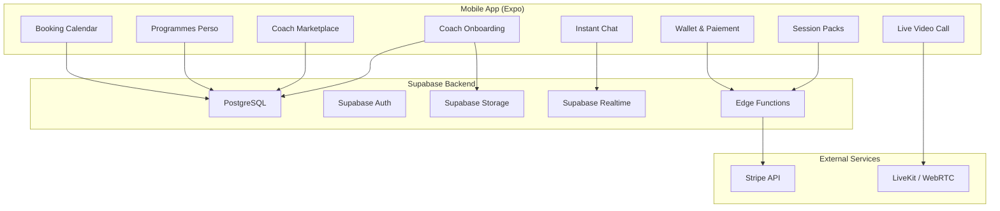

# GoFit Phase 5: Coach Marketplace

## Current State

The GoFit app is a React Native (Expo SDK 54) fitness app with a Supabase backend and a Next.js admin panel. Phases 1-4 are complete: auth, onboarding, exercise/workout library, workout sessions, progress tracking, calendar, notifications, and admin CRUD. There is **no coach system, no payments, no chat, no video calls** -- these are all greenfield.

**Existing stack:** Expo 54, TypeScript, Zustand, Supabase (Postgres + Auth + Storage + Realtime), React Navigation, i18next (EN/FR), Next.js 16 admin panel with shadcn/ui.

---

## Architecture Overview

---

## Database Schema (new tables)

All new tables go in `database/schema/` and migrations in `database/migrations/`.

**Modified tables:**

- `**user_profiles`** -- add `user_type` column (`client` | `coach`, default `client`)

**New tables:**

- `**coach_profiles`** -- `user_id` (FK), `bio`, `specialties` (text[]), `hourly_rate`, `cv_url`, `is_verified`, `average_rating`, `total_reviews`, `total_sessions`, `status` (pending/approved/rejected), `cancellation_policy` (flexible/moderate/strict), `stripe_account_id`
- `**coach_certifications`** -- `id`, `coach_id` (FK), `name`, `issuer`, `document_url`, `verified_at`, `status` (pending/verified/rejected)
- `**coach_reviews`** -- `id`, `coach_id`, `client_id`, `rating` (1-5), `comment`, `created_at`
- `**coach_availability`** -- `id`, `coach_id`, `day_of_week` (0-6), `start_time`, `end_time`
- `**session_packs`** -- `id`, `coach_id`, `name`, `session_count`, `price`, `currency`, `description`, `is_active`
- `**purchased_packs`** -- `id`, `client_id`, `pack_id`, `coach_id`, `sessions_remaining`, `purchased_at`, `expires_at`, `stripe_payment_id`
- `**bookings`** -- `id`, `coach_id`, `client_id`, `pack_purchase_id`, `scheduled_at`, `duration_minutes`, `status` (pending/confirmed/completed/cancelled), `video_room_id`, `notes`, `cancelled_at`, `cancel_reason`, `rescheduled_from`
- `**custom_programs`** -- `id`, `coach_id`, `client_id`, `title`, `description`, `type` (workout/meal/both), `program_data` (JSONB), `created_at`
- `**conversations`** -- `id`, `coach_id`, `client_id`, `last_message_at`, `created_at`
- `**messages`** -- `id`, `conversation_id`, `sender_id`, `content`, `type` (text/image/file/voice), `media_url`, `media_metadata` (JSONB), `read_at`, `created_at`
- `**wallets`** -- `id`, `coach_id`, `balance`, `currency`
- `**transactions`** -- `id`, `wallet_id`, `type` (earning/payout/refund), `amount`, `description`, `stripe_transfer_id`, `created_at`
- `**coach_client_notes`** -- `id`, `coach_id`, `client_id`, `note`, `created_at`, `updated_at`
- `**push_tokens`** -- `id`, `user_id`, `expo_push_token`, `platform` (ios/android), `created_at`
- `**notifications`** -- `id`, `user_id`, `type`, `title`, `body`, `data` (JSONB), `read_at`, `created_at`

**Supabase Storage buckets:** `coach-documents` (CVs, certs), `chat-media` (images, files, voice messages).

**RLS policies:** coaches read/write their own data; clients read coach public profiles; messages scoped to conversation participants; bookings scoped to involved coach + client; coaches can read `workout_sessions` only for clients with active packs.

**Database functions/triggers:**

- Trigger on `coach_reviews` insert/delete to recompute `coach_profiles.average_rating` and `total_reviews`
- RPC function `get_coach_dashboard_stats(coach_id)` for aggregated analytics
- RPC function `get_client_progress(client_id, coach_id)` for client fitness data with relationship check
- Trigger on `user_profiles` insert to sync `user_type` from auth metadata

**Supabase Edge Functions:**

- `create-checkout` -- Stripe PaymentIntent for pack purchase
- `stripe-webhook` -- handles payment events, creates records
- `request-payout` -- Stripe Transfer to coach's connected account
- `send-push-notification` -- sends push via Expo Push API
- `generate-video-token` -- creates LiveKit/Agora room token

---

## Sprint 5.1 -- Coach Auth + Onboarding + Marketplace (2 weeks)

### 0. Separate Coach Auth Flow

Coaches register via a **dedicated signup flow** (not the client flow). The existing `WelcomeScreen` gets a "I'm a Coach" CTA that leads to a `CoachAuthNavigator`.

**New navigation:** `CoachAuthNavigator` stack with:

- `CoachWelcomeScreen` -- coach-specific branding and value proposition
- `CoachSignupScreen` -- email/password signup with `user_metadata.user_type = 'coach'`
- `CoachLoginScreen` -- login that checks `user_type` and routes to coach app

**Auth metadata:** On signup, `supabase.auth.signUp()` sets `data: { user_type: 'coach' }` in `user_metadata`. The `RootNavigator` reads this to decide whether to show client tabs or coach tabs.

**Database:** Add `user_type` column (`client` | `coach`) to `user_profiles` table (default `client`), synced from auth metadata via a Supabase trigger.

### 1. Coach Onboarding

**Database:** `coach_profiles`, `coach_certifications` tables + RLS + Storage bucket `coach-documents`.

**Mobile screens** (new `CoachOnboardingNavigator` after coach signup):

- `CoachOnboardingScreen` -- multi-step form: bio, specialties (multi-select from predefined list), hourly rate
- `CoachCVUploadScreen` -- CV/resume upload via `expo-document-picker` to Supabase Storage
- `CoachCertificationsScreen` -- add certifications with document upload, shows verification status
- `CoachProfilePreviewScreen` -- preview before submission
- `CoachPendingScreen` -- shown after submission while admin verifies (status: pending)

**Services:** `GoFitMobile/src/services/coachProfile.ts`
**Store:** `GoFitMobile/src/store/coachStore.ts` (Zustand)
**Admin:** New `/coaches` section in admin panel for verifying profiles and certifications.

### 2. Coach Marketplace

**Mobile screens:**

- `MarketplaceScreen` -- replaces `MOCK_TRAINERS` in [GoFitMobile/src/components/home/TopTrainers.tsx](GoFitMobile/src/components/home/TopTrainers.tsx); grid/list of verified coaches with avatar, name, specialties, rating, hourly rate
- `CoachDetailScreen` -- full coach profile with reviews, certifications (verified badge), session packs, "Book" and "Chat" CTAs
- Search/filter bar: filter by specialty, rating, price range, sort by rating/price

**Services:** `GoFitMobile/src/services/marketplace.ts` -- paginated coach listing with filters via Supabase PostgREST.

### 3. Coach Reviews / Ratings

- `coach_reviews` table
- Review form shown after a completed booking
- Average rating computed via Supabase database function (trigger on insert/update/delete)

---

## Sprint 5.2 -- Session Packs + Custom Programs (1 week)

### 4. Session Packs (Packs de Sessions)

**Mobile screens:**

- `SessionPacksScreen` -- list of packs offered by a coach (accessible from `CoachDetailScreen`)
- `PackPurchaseScreen` -- purchase flow: select pack, Stripe payment sheet
- `MyPacksScreen` -- client view of purchased packs with remaining sessions

**Stripe Integration:**

- `expo-stripe` (or `@stripe/stripe-react-native`) for mobile payment sheet
- Supabase Edge Function `create-checkout` -- creates Stripe PaymentIntent, returns client secret
- Supabase Edge Function `stripe-webhook` -- handles `payment_intent.succeeded`, creates `purchased_packs` record
- Coaches will need Stripe Connect accounts (onboarded during coach setup) for split payments

**Services:** `GoFitMobile/src/services/sessionPacks.ts`, `GoFitMobile/src/services/payments.ts`
**Store:** `GoFitMobile/src/store/packsStore.ts`

### 5. Programmes Perso (Custom Programs)

**Mobile screens:**

- **Coach side:** `ProgramBuilderScreen` -- create workout/meal plan using JSONB structure (exercises from existing library + custom entries for meals), assign to a client
- **Client side:** `MyProgramsScreen` -- list of programs received from coaches; `ProgramDetailScreen` -- view program details, mark items complete

**Services:** `GoFitMobile/src/services/programs.ts`
**Store:** `GoFitMobile/src/store/programsStore.ts`

Leverages existing exercise data model. Meal plans stored as structured JSONB (day, meal type, items, macros).

---

## Sprint 5.3 -- Video, Calendar, Chat, Wallet (1 week)

### 6. Live Video Call

**Technology choice:** LiveKit (open-source WebRTC SFU) or Agora as a managed service. Both have React Native SDKs. LiveKit is recommended for cost control (self-hostable).

- Supabase Edge Function to generate LiveKit/Agora room tokens
- `VideoCallScreen` -- full-screen video UI with mute, camera toggle, end call
- Triggered from a booking: when `booking.scheduled_at` arrives, both parties see a "Join Call" button
- `@livekit/react-native` or `react-native-agora` SDK

### 7. Gestion Calendrier (Booking Calendar)

**Mobile screens:**

- **Coach side:** `CoachAvailabilityScreen` -- set weekly availability slots (day + time ranges)
- **Client side:** booking flow from `CoachDetailScreen` -- select available slot, confirm with a pack session deduction
- `BookingsListScreen` -- upcoming/past bookings for both roles
- `BookingDetailScreen` -- booking details with cancel/reschedule actions

**Database:** `coach_availability` table (day_of_week, start_time, end_time) + `bookings` table. Add `cancellation_policy` column to `coach_profiles` (flexible/moderate/strict). Add `cancelled_at`, `cancel_reason`, `rescheduled_from` columns to `bookings`.

**Cancellation/Rescheduling Policy:**

- **Flexible:** free cancellation up to 2h before, full session credit refund
- **Moderate:** free cancellation up to 24h before, 50% credit after
- **Strict:** free cancellation up to 48h before, no credit after
- Rescheduling = cancel + rebook; same policy applies
- Coach sets their policy during onboarding; visible on `CoachDetailScreen`

**Notifications:** Push notifications via `expo-notifications` for booking confirmations, reminders (30 min before), and cancellation alerts.

### 8. Instant Chat (with Media)

**Technology:** Supabase Realtime (already in use for workout sessions) -- no need for a separate Socket.io server.

**Mobile screens:**

- `ConversationsListScreen` -- list of active conversations with unread badges
- `ChatScreen` -- real-time messaging with `supabase.channel().on('postgres_changes', ...)` on `messages` table

**Message types** (stored in `messages.type` column: `text` | `image` | `file` | `voice`):

- **Text:** standard text messages
- **Image:** pick from gallery via `expo-image-picker`, upload to Supabase Storage `chat-media` bucket, store URL in `messages.media_url`
- **File:** attach documents via `expo-document-picker`, upload to Storage, display as downloadable link
- **Voice messages:** record via `expo-av` Audio.Recording, upload `.m4a` to Storage, playback with waveform visualization in chat bubble

**Database:** Add `type`, `media_url`, `media_metadata` (JSONB: filename, size, duration for voice) columns to `messages` table.

**Services:** `GoFitMobile/src/services/chat.ts`
**Store:** `GoFitMobile/src/store/chatStore.ts`

Typing indicators via Supabase Realtime Broadcast. Read receipts via `messages.read_at`.

### 9. Wallet and Paiement

**Mobile screens (coach side):**

- `WalletScreen` -- balance, earnings history, payout button
- `TransactionHistoryScreen` -- list of transactions

**Backend:**

- Stripe Connect for coach payouts
- Supabase Edge Function `request-payout` -- initiates Stripe Transfer to coach's connected account
- Platform fee deduction (configurable in `admin_settings`)

**Admin panel:**

- `/coaches` page with verification workflow
- `/transactions` page for monitoring payments
- Configurable platform fee percentage

### 10. Coach Analytics Dashboard

**Mobile screen:** `CoachDashboardScreen` -- the coach's home tab, showing:

- **Earnings overview:** total earnings this month, comparison to last month
- **Session stats:** total sessions completed, upcoming sessions count
- **Client engagement:** active clients count, new clients this month
- **Rating trend:** current average rating, recent reviews preview
- **Monthly revenue chart:** bar/line chart using `react-native-chart-kit` (already a dependency)

**Data source:** Aggregated from `bookings`, `transactions`, `coach_reviews`, `purchased_packs` tables via Supabase views or RPC functions for performance.

---

## Sprint 5.4 -- Client Management, Progress Sharing, Notifications (1 week)

### 11. Progress Sharing (Coach sees Client Data)

Coaches need visibility into their client's fitness data to create effective programs.

**Database:**

- New RLS policy on `workout_sessions`: coaches can SELECT sessions for clients who have an active `purchased_packs` record with them (i.e., an active coaching relationship)
- Supabase RPC function `get_client_progress(client_id, coach_id)` returns: recent sessions, streak, total workouts, personal records, consistency percentage

**Mobile screens (coach side):**

- `ClientProgressScreen` -- accessible from `ClientDetailScreen`; shows the client's workout history, stats charts (reusing `react-native-chart-kit`), personal records, and consistency view
- Read-only -- coaches cannot modify client data

**Privacy:** Only coaches with an active pack relationship can view client progress. When the pack expires or is exhausted, access is revoked automatically via RLS.

### 12. Client Management

**Database:** New `coach_client_notes` table: `id`, `coach_id`, `client_id`, `note`, `created_at`, `updated_at`

**Mobile screens (coach side, under Clients tab):**

- `ClientsListScreen` -- all clients who have purchased packs from this coach, with avatar, name, active pack status, last session date
- `ClientDetailScreen` -- client profile summary, active programs, booking history, coach's private notes, quick actions: "Message", "Create Program", "View Progress"
- `ClientNotesScreen` -- add/edit private notes about the client (goals, injuries, preferences)

**Services:** `GoFitMobile/src/services/clientManagement.ts`

### 13. Unified Notification Center

The current app uses local-only notifications. Phase 5 requires remote push for real-time events across coach and client.

**Setup:**

- Register device push token via `expo-notifications.getExpoPushTokenAsync()` on app launch
- Store token in new `push_tokens` table: `id`, `user_id`, `expo_push_token`, `platform` (ios/android), `created_at`
- Supabase Edge Function `send-push-notification` -- uses Expo Push API to deliver notifications

**Notification types:**

- `new_message` -- when a chat message is received (sender triggers Edge Function)
- `booking_confirmed` / `booking_cancelled` / `booking_reminder` -- booking lifecycle events
- `payment_received` -- coach gets notified when a client purchases a pack
- `new_review` -- coach gets notified of a new review
- `program_received` -- client gets notified when coach sends a program
- `coach_verified` -- coach gets notified when admin approves their profile

**Mobile screens:**

- `NotificationInboxScreen` -- chronological list of all notifications, grouped by date, with read/unread styling
- Accessible from a bell icon in the header (both client and coach apps)
- Tapping a notification navigates to the relevant screen (deep navigation)

**Database:** New `notifications` table: `id`, `user_id`, `type`, `title`, `body`, `data` (JSONB for navigation params), `read_at`, `created_at`

### 14. Client Payment History

**Mobile screens (client side, accessible from Profile tab):**

- `PaymentHistoryScreen` -- chronological list of all pack purchases with: coach name, pack name, amount, date, status (completed/refunded)
- `ReceiptDetailScreen` -- full receipt: pack details, coach info, payment method (last 4 digits), Stripe receipt URL

**Data source:** `purchased_packs` joined with `session_packs` and `coach_profiles`.

---

## Sprint 5.5 -- Polish and Testing (1 week)

### 15. Skeleton Loading and Deep Linking

**Skeleton loading** (consistent with existing `TopWorkouts` shimmer pattern in the app):

- `MarketplaceScreen` -- skeleton grid of coach cards while loading
- `CoachDetailScreen` -- skeleton header + sections
- `ConversationsListScreen` -- skeleton conversation rows
- `ChatScreen` -- skeleton message bubbles on initial load
- `ClientsListScreen` -- skeleton client rows
- Reusable `SkeletonCard`, `SkeletonRow`, `SkeletonAvatar` components in `GoFitMobile/src/components/shared/`

**Deep linking** (shareable coach profile URLs):

- URL scheme: `gofit://coach/{coach_id}` and web fallback `https://gofit.app/coach/{coach_id}`
- Configure via `expo-linking` in `app.json` and React Navigation linking config
- Opening a coach link while logged in navigates to `CoachDetailScreen`
- Opening while logged out shows `WelcomeScreen` first, then redirects after auth

### 16. Tests and Fixes

- End-to-end testing on iOS and Android (Expo Dev Client)
- Stripe test mode validation (purchase flow, webhook handling, payouts)
- Video call quality testing on real devices
- Chat message delivery and ordering validation
- Performance profiling: FlatList virtualization for marketplace, message lists
- RLS policy verification for all new tables
- i18n: all new strings in EN/FR via `GoFitMobile/src/i18n/`
- Admin panel: coach verification workflow testing

---

## Navigation Changes

Two completely separate tab navigators based on `user_type`:

```mermaid
graph TD
  Root["RootNavigator"]
  Root --> ClientAuth["ClientAuthNavigator"]
  Root --> CoachAuth["CoachAuthNavigator"]
  Root --> ClientOnboard["ClientOnboardingNavigator"]
  Root --> CoachOnboard["CoachOnboardingNavigator"]
  Root --> ClientApp["ClientAppNavigator (Tabs)"]
  Root --> CoachApp["CoachAppNavigator (Tabs)"]

  subgraph clientTabs ["Client Tabs"]
    HomeTab["Home"]
    WorkoutsTab["Workouts"]
    LibraryTab["Library"]
    ProgressTab["Progress"]
    ProfileTab["Profile"]
  end

  ClientApp --> HomeTab
  ClientApp --> WorkoutsTab
  ClientApp --> LibraryTab
  ClientApp --> ProgressTab
  ClientApp --> ProfileTab

  HomeTab --> MarketplaceScreen["MarketplaceScreen"]
  MarketplaceScreen --> CoachDetail["CoachDetailScreen"]
  CoachDetail --> SessionPacksScr["SessionPacksScreen"]
  CoachDetail --> BookingFlow["BookingFlow"]
  CoachDetail --> ChatScr["ChatScreen"]
  ProfileTab --> MyPacks["MyPacksScreen"]
  ProfileTab --> MyPrograms["MyProgramsScreen"]
  ProfileTab --> Conversations["ConversationsListScreen"]
  ProfileTab --> MyBookings["MyBookingsScreen"]
  ProfileTab --> PaymentHistory["PaymentHistoryScreen"]
  HomeTab --> NotifInbox["NotificationInboxScreen"]

  subgraph coachTabs ["Coach Tabs"]
    Dashboard["Dashboard"]
    CoachClients["Clients"]
    CoachCalendar["Calendar"]
    CoachChat["Chat"]
    CoachProfile["Profile"]
  end

  CoachApp --> Dashboard
  CoachApp --> CoachClients
  CoachApp --> CoachCalendar
  CoachApp --> CoachChat
  CoachApp --> CoachProfile

  Dashboard --> Analytics["Analytics + Earnings"]
  Dashboard --> NotifInboxCoach["NotificationInboxScreen"]
  CoachClients --> ClientDetail["ClientDetailScreen"]
  ClientDetail --> ClientProgress["ClientProgressScreen"]
  ClientDetail --> ClientNotes["ClientNotesScreen"]
  ClientDetail --> ProgramBuilder["ProgramBuilderScreen"]
  CoachCalendar --> Availability["AvailabilityScreen"]
  CoachProfile --> WalletScr["WalletScreen"]
```

