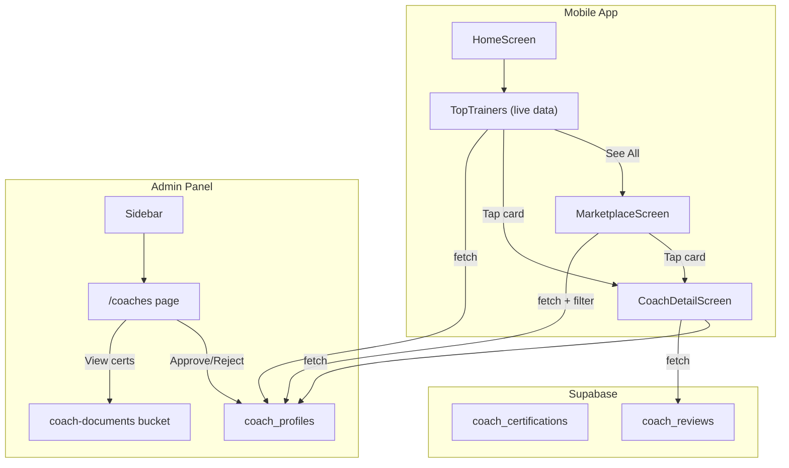

# Coach Marketplace + Admin Coach Verification

## Architecture

---

## Part 1: Mobile -- Marketplace Service + Store

**New file:** `[GoFitMobile/src/services/marketplace.ts](GoFitMobile/src/services/marketplace.ts)`

- `getApprovedCoaches(filters?)` -- query `coach_profiles` with `status = 'approved'`, join `user_profiles` for display name/picture, support filter by specialty, sort by rating/reviews
- `getCoachDetail(coachId)` -- single coach with certifications
- `getCoachReviews(coachId)` -- paginated reviews from `coach_reviews`

**New file:** `[GoFitMobile/src/store/marketplaceStore.ts](GoFitMobile/src/store/marketplaceStore.ts)`

- Zustand store: `coaches[]`, `selectedCoach`, `reviews[]`, `filters`, `loading`
- `loadCoaches(filters?)`, `loadCoachDetail(id)`, `loadReviews(coachId)`

---

## Part 2: Mobile -- Marketplace Screens

**New file:** `[GoFitMobile/src/screens/marketplace/MarketplaceScreen.tsx](GoFitMobile/src/screens/marketplace/MarketplaceScreen.tsx)`

- Full coach listing with search bar + specialty filter chips
- `FlatList` of coach cards (profile picture, name, specialties, rating, hourly rate, verified badge)
- Pull-to-refresh, empty state

**New file:** `[GoFitMobile/src/screens/marketplace/CoachDetailScreen.tsx](GoFitMobile/src/screens/marketplace/CoachDetailScreen.tsx)`

- Coach hero (picture, name, rating, total sessions, hourly rate)
- Bio section, specialties chips, certifications list (with verified badges)
- Reviews section (recent reviews with avatar, rating, comment)
- CTA button: "Book a Session" (placeholder for now, will be wired in booking task)

---

## Part 3: Mobile -- Update TopTrainers + Navigation

**Modify:** `[GoFitMobile/src/components/home/TopTrainers.tsx](GoFitMobile/src/components/home/TopTrainers.tsx)`

- Replace `MOCK_TRAINERS` with live data from `marketplaceStore.loadCoaches()` (top 5 by rating)
- "See All" navigates to `MarketplaceScreen`
- Tapping a card navigates to `CoachDetailScreen`

**Modify:** `[GoFitMobile/src/navigation/AppNavigator.tsx](GoFitMobile/src/navigation/AppNavigator.tsx)`

- Add `MarketplaceScreen` and `CoachDetailScreen` as stack screens inside the Home stack (or as root-level stack screens accessible from any tab)

**Modify:** `[GoFitMobile/src/types/index.ts](GoFitMobile/src/types/index.ts)`

- Add `Marketplace` and `CoachDetail: { coachId: string }` to the relevant param list

**Modify:** EN/FR i18n files with marketplace translations

---

## Part 4: Admin Panel -- Coaches Page

**New file:** `[admin-panel/app/coaches/layout.tsx](admin-panel/app/coaches/layout.tsx)`

- Re-export dashboard layout (same pattern as `/users/layout.tsx`)

**New file:** `[admin-panel/app/coaches/page.tsx](admin-panel/app/coaches/page.tsx)`

- Server component using `createAdminClient()` to fetch all `coach_profiles` joined with `auth.users` for email/name
- Stats row: total coaches, pending, approved, rejected
- Table: name, email, specialties, status badge, rating, created_at, actions
- Filter tabs: All / Pending / Approved / Rejected

**New file:** `[admin-panel/components/coaches/CoachSearchFilter.tsx](admin-panel/components/coaches/CoachSearchFilter.tsx)`

- Client component: search by name/email, filter by status
- Same pattern as existing `UserSearchFilter.tsx`

**New file:** `[admin-panel/components/coaches/CoachActions.tsx](admin-panel/components/coaches/CoachActions.tsx)`

- Approve / Reject buttons with confirmation dialogs
- View CV link (opens `coach-documents` URL)
- View certifications list with verify/reject per cert

**New file:** `[admin-panel/app/api/coaches/route.ts](admin-panel/app/api/coaches/route.ts)`

- `PATCH` handler: update `coach_profiles.status` (approve/reject)
- Uses `createAdminClient()` to bypass RLS

**New file:** `[admin-panel/app/api/coaches/[id]/certifications/route.ts](admin-panel/app/api/coaches/[id]/certifications/route.ts)`

- `PATCH` handler: update `coach_certifications.status` (verify/reject)

**Modify:** `[admin-panel/components/layout/Sidebar.tsx](admin-panel/components/layout/Sidebar.tsx)` and `[MobileSidebar.tsx](admin-panel/components/layout/MobileSidebar.tsx)`

- Add `{ name: "Coaches", href: "/coaches", icon: UserCheck }` after Users

**Modify:** `[admin-panel/middleware.ts](admin-panel/middleware.ts)`

- Add `/coaches` to `protectedPaths`

