# GoFit — Full Project Report & Architecture Documentation

**Purpose:** Academic / professional report with architecture, methodology (Scrum / Agile), and diagrams.  
**Last updated:** March 2026.

> **Rendering diagrams:** Mermaid blocks render in GitHub, GitLab, many Markdown viewers, and [mermaid.live](https://mermaid.live). For Word/PDF, export diagrams from mermaid.live as PNG/SVG and insert them.

---

## Table of contents

1. [Executive summary](#1-executive-summary)  
2. [Methodology — Scrum & Agile](#2-methodology--scrum--agile)  
3. [System context & high-level architecture](#3-system-context--high-level-architecture)  
4. [Container & component architecture](#4-container--component-architecture)  
5. [Mobile app architecture](#5-mobile-app-architecture)  
6. [Admin panel architecture](#6-admin-panel-architecture)  
7. [Data & security architecture](#7-data--security-architecture)  
8. [Key user flows (sequences)](#8-key-user-flows-sequences)  
9. [Technology stack](#9-technology-stack)  
10. [Repository structure](#10-repository-structure)  
11. [Sprint roadmap (Gantt)](#11-sprint-roadmap-gantt)  
12. [References](#12-references)

---

## 1. Executive summary

**GoFit** is a fitness platform consisting of:

- A **cross-platform mobile app** (React Native / Expo) for **clients** and **coaches**.
- A **web admin panel** (Next.js) for content and user management.
- A **backend-as-a-service** on **Supabase** (PostgreSQL, Auth, Storage, Realtime).

The project is organized using **Scrum**: fixed-length sprints, a product backlog, and incremental delivery of potentially shippable features.

---

## 2. Methodology — Scrum & Agile

### 2.1 Agile principles applied

- **Iterative delivery:** work is split into time-boxed **sprints** (2 weeks in the project plan).
- **Incremental value:** each sprint aims for a **potentially shippable increment**.
- **Adaptation:** backlog is refined based on stakeholder feedback and technical discovery.
- **Collaboration:** clear roles (Product Owner, Scrum Master, Developers) — adjust names to your team.

### 2.2 Scrum framework — roles, events, artifacts

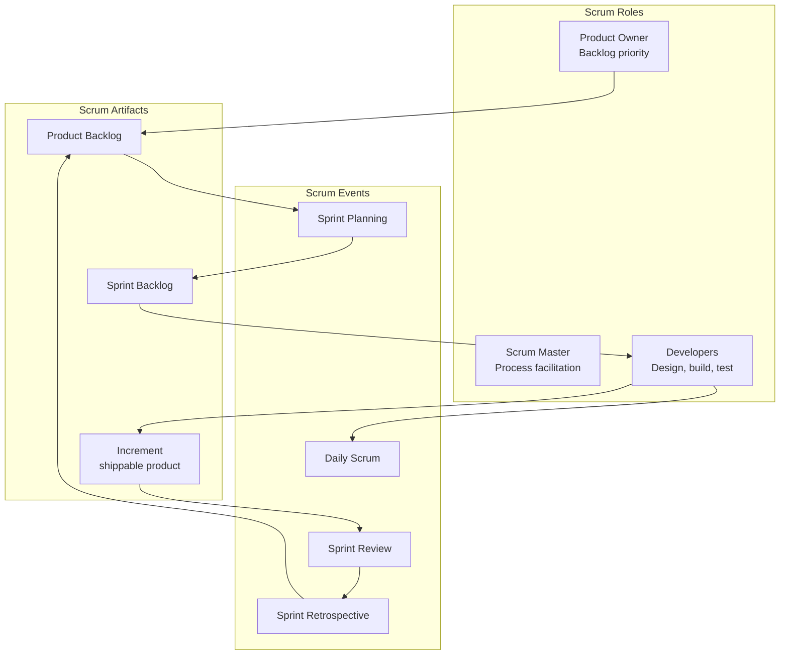

### 2.3 Sprint lifecycle (one iteration)

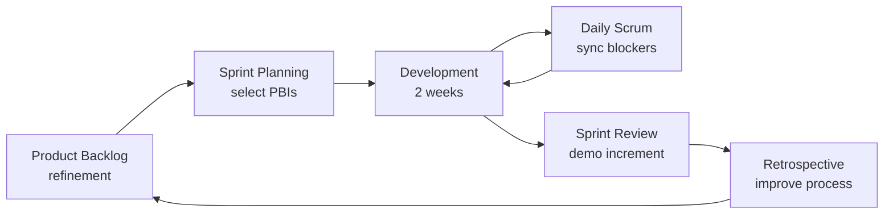

### 2.4 Flow from backlog to production increment

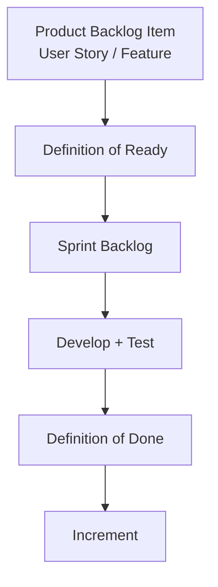

### 2.5 How GoFit phases map to Scrum (example)

| Concept | GoFit application |
|--------|------------------|
| Product Backlog | Features from cahier des charges, Phase 5 marketplace, admin, payments |
| Sprint Goal | e.g. “Ship exercise library + progress charts” |
| Increment | Working mobile build + DB migrations + admin pages where applicable |
| Burndown | Tasks closed per sprint (tracked in your tool: Jira, Azure DevOps, Notion, etc.) |

---

## 3. System context & high-level architecture

### 3.1 System context (who uses what)

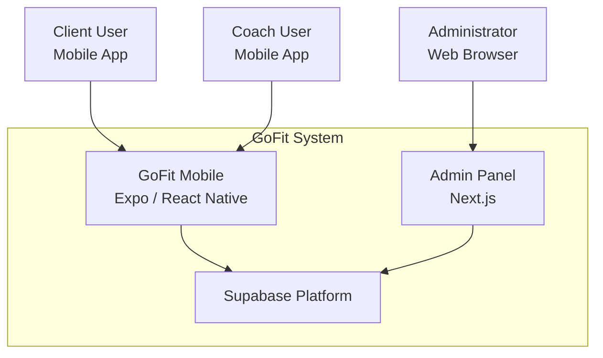

### 3.2 Logical deployment view

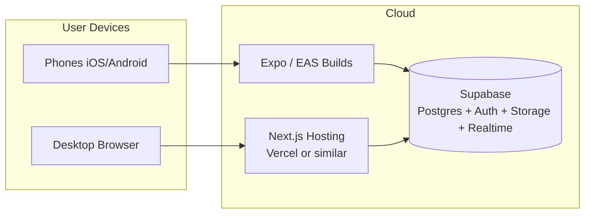

---

## 4. Container & component architecture

### 4.1 Containers communicating with Supabase

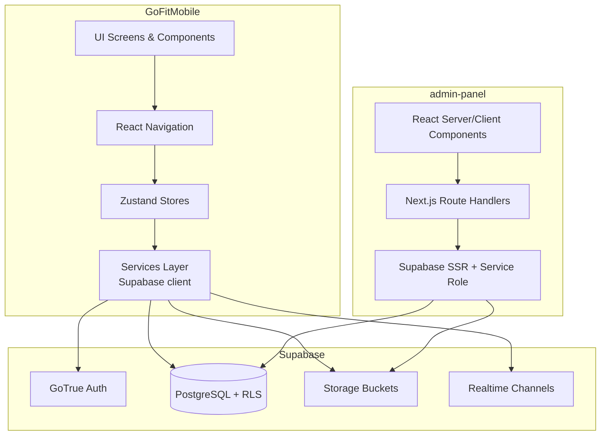

### 4.2 Layered architecture (mobile)

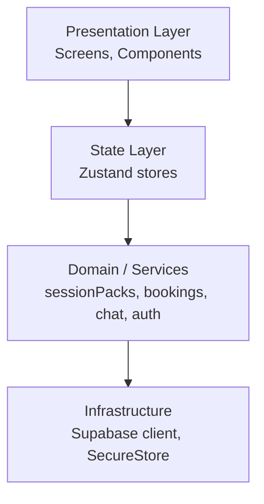

---

## 5. Mobile app architecture

### 5.1 Root navigation decision (client vs coach)

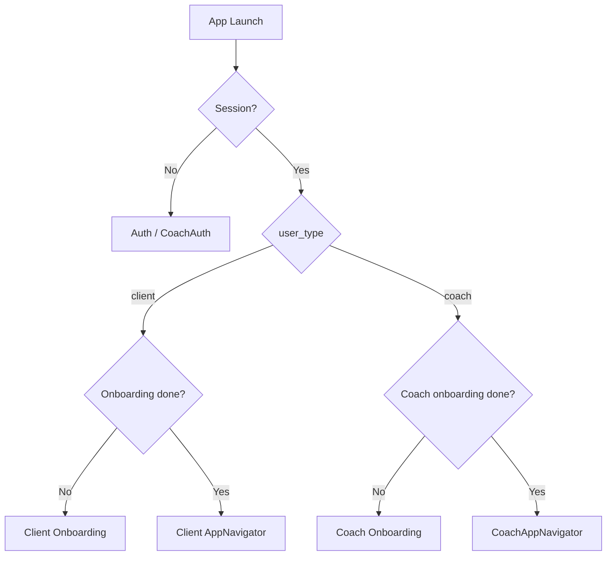

### 5.2 Client app — tab & stack overview

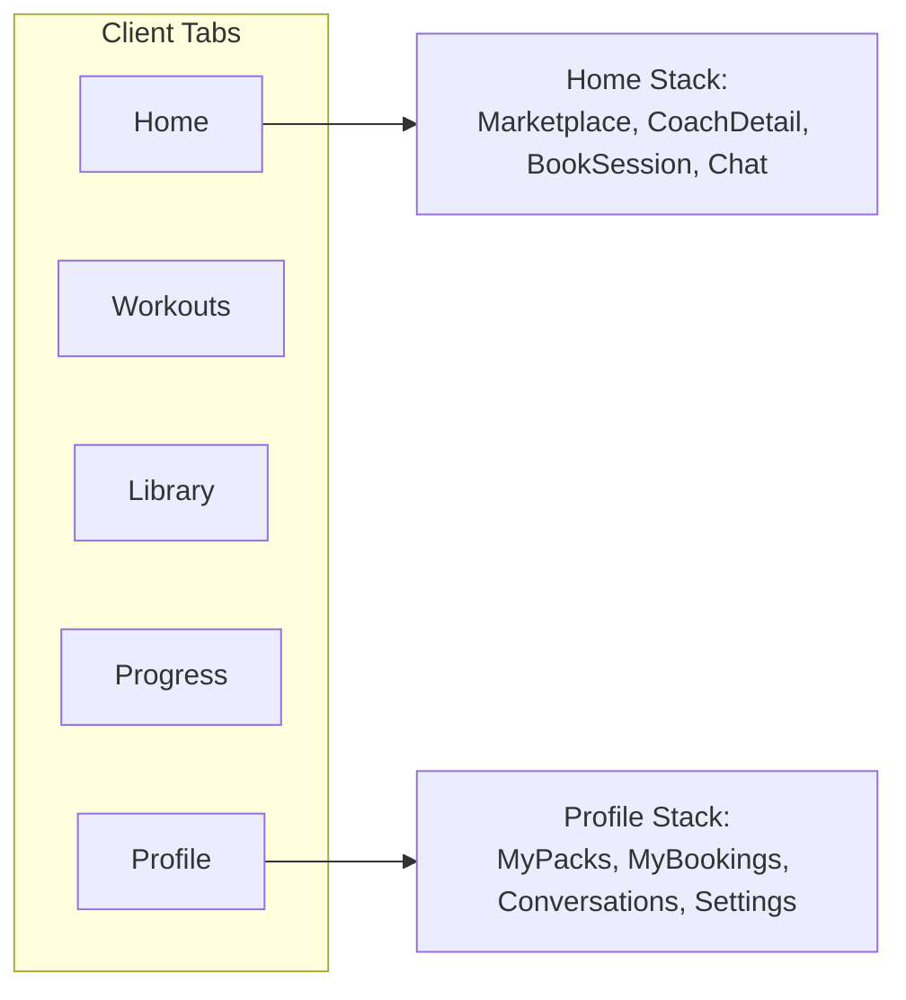

### 5.3 Coach app — tab overview

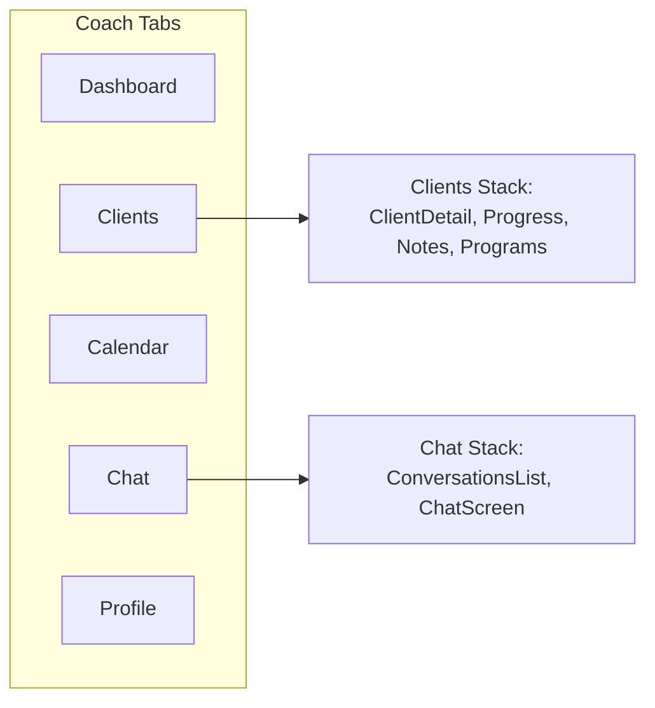

---

## 6. Admin panel architecture

### 6.1 Main routes (App Router)

```mermaid
flowchart TD
  ROOT[/dashboard] --> U[/users]
  ROOT --> E[/exercises]
  ROOT --> WO[/workouts]
  ROOT --> CO[/coaches]
  ROOT --> TR[/transactions]
  ROOT --> AL[/activity-logs]
  ROOT --> ST[/settings]
  LOGIN[/login] --> ROOT
```

### 6.2 Admin data access pattern

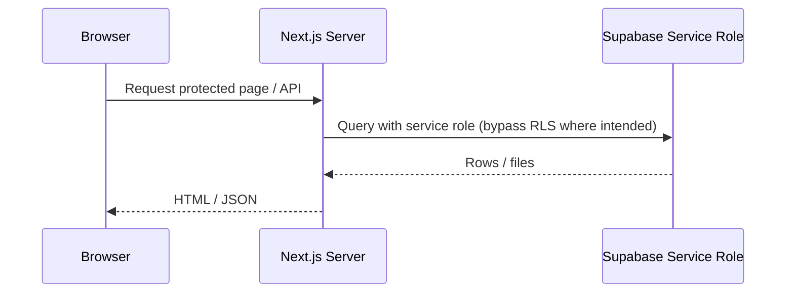

---

## 7. Data & security architecture

### 7.1 Simplified entity-relationship (core fitness)

```mermaid
erDiagram
  USERS ||--o| USER_PROFILES : has
  USERS ||--o{ WORKOUT_SESSIONS : performs
  WORKOUTS ||--o{ WORKOUT_EXERCISES : contains
  EXERCISES ||--o{ WORKOUT_EXERCISES : referenced_by
  WORKOUTS ||--o{ WORKOUT_SESSIONS : template
  USERS {
    uuid id PK
  }
  USER_PROFILES {
    uuid id PK_FK
    text user_type
  }
  WORKOUTS {
    uuid id PK
    text name
    text workout_type
  }
  WORKOUT_SESSIONS {
    uuid id PK
    uuid user_id FK
    uuid workout_id FK
    timestamptz started_at
  }
  EXERCISES {
    uuid id PK
    text name
  }
```

### 7.2 Marketplace / coaching extension (Phase 5 — simplified)

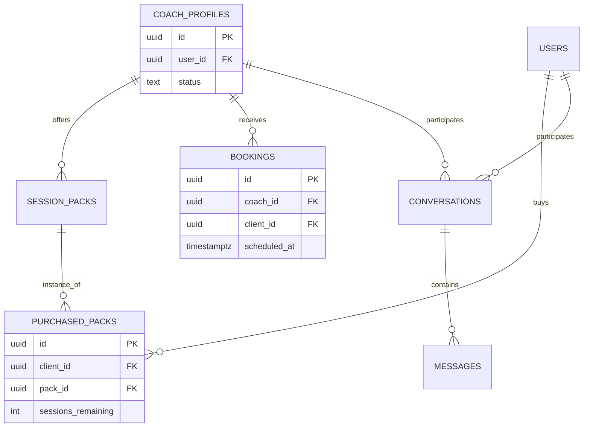

### 7.3 Row-Level Security (RLS) concept

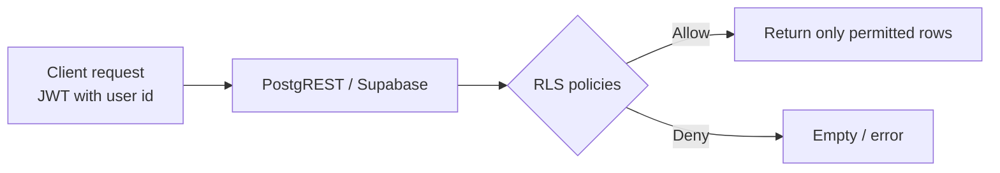

---

## 8. Key user flows (sequences)

### 8.1 Sign-in and data fetch (mobile)

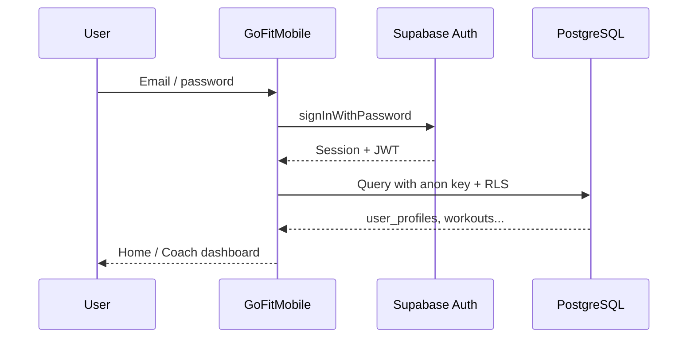

### 8.2 Book session (simplified)

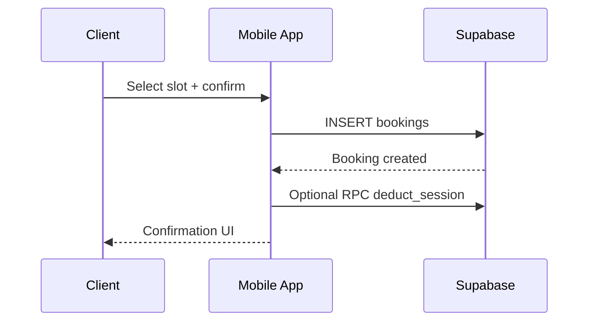

---

## 9. Technology stack

| Layer | Mobile (`GoFitMobile`) | Admin (`admin-panel`) | Backend |
|-------|------------------------|------------------------|---------|
| UI | React Native, Expo, Lucide | Next.js 16, shadcn/ui, Tailwind | — |
| State | Zustand | React state / Server Components | — |
| API | supabase-js (anon) | supabase-js + SSR, service role in API routes | Supabase |
| DB | — | — | PostgreSQL + RLS |
| Auth | Supabase Auth | Supabase Auth (admin users) | GoTrue |
| i18n | i18next (EN/FR) | — | — |

---

## 10. Repository structure

```
GoFit/
├── GoFitMobile/       # Expo app (App.tsx, src/screens, services, store, navigation)
├── admin-panel/       # Next.js app (app/, components/, app/api/)
├── database/          # schema/, migrations/, functions/*.sql, policies/
├── docs/              # This report, gantt/, architecture/, admin-panel/
└── README.md
```

---

## 11. Sprint roadmap (Gantt)

Aligned with `docs/gantt/SCRUM_SPRINT_BREAKDOWN.md` (13 sprints × 2 weeks).

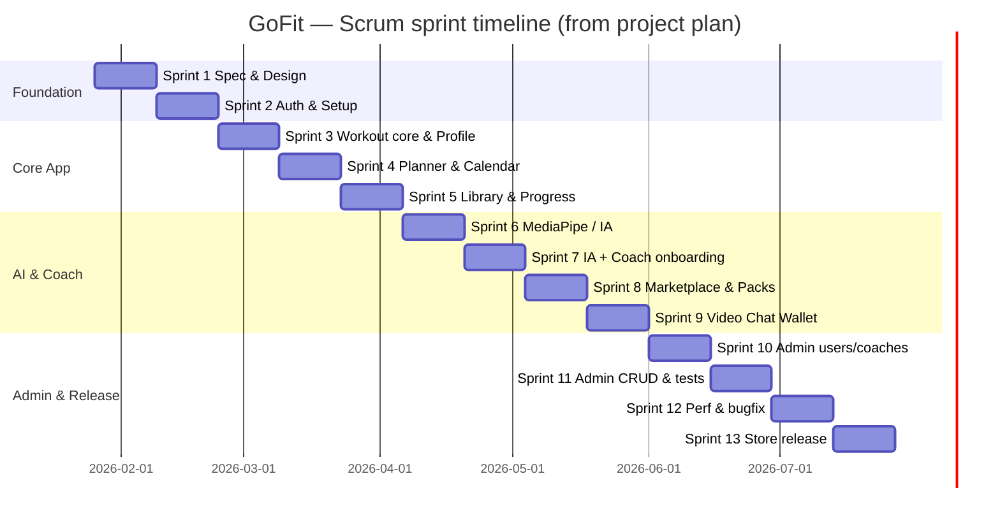

---

## 12. References

| Document | Location |
|----------|----------|
| Monorepo README | `README.md` |
| Mobile guide | `GoFitMobile/PROJECT_GUIDE.md` |
| Database model | `database/DATABASE_STRUCTURE.md` |
| Scrum sprint table | `docs/gantt/SCRUM_SPRINT_BREAKDOWN.md` |
| Admin features | `docs/admin-panel/ADMIN_PANEL_FEATURES.md` |
| Phase 5 scope | `.cursor/plans/gofit_phase_5_plan_*.plan.md` |

---

## Appendix A — Diagram checklist for your report

Use this checklist when building your final PDF/thesis:

| # | Diagram | Section |
|---|---------|---------|
| 1 | Scrum roles / events / artifacts | §2.2 |
| 2 | Sprint lifecycle | §2.3 |
| 3 | Backlog → increment | §2.4 |
| 4 | System context | §3.1 |
| 5 | Deployment view | §3.2 |
| 6 | Containers + Supabase | §4.1 |
| 7 | Mobile layers | §4.2 |
| 8 | Root navigation | §5.1 |
| 9 | Client tabs | §5.2 |
| 10 | Coach tabs | §5.3 |
| 11 | Admin routes | §6.1 |
| 12 | Admin sequence | §6.2 |
| 13 | ER core fitness | §7.1 |
| 14 | ER marketplace | §7.2 |
| 15 | RLS concept | §7.3 |
| 16 | Sign-in sequence | §8.1 |
| 17 | Booking sequence | §8.2 |
| 18 | Gantt sprints | §11 |

---

## Appendix B — License

Private project — adjust per your institution.

---

*If any diagram or statement conflicts with the current codebase or your live Supabase project, prefer the repository and applied migrations as the source of truth.*
