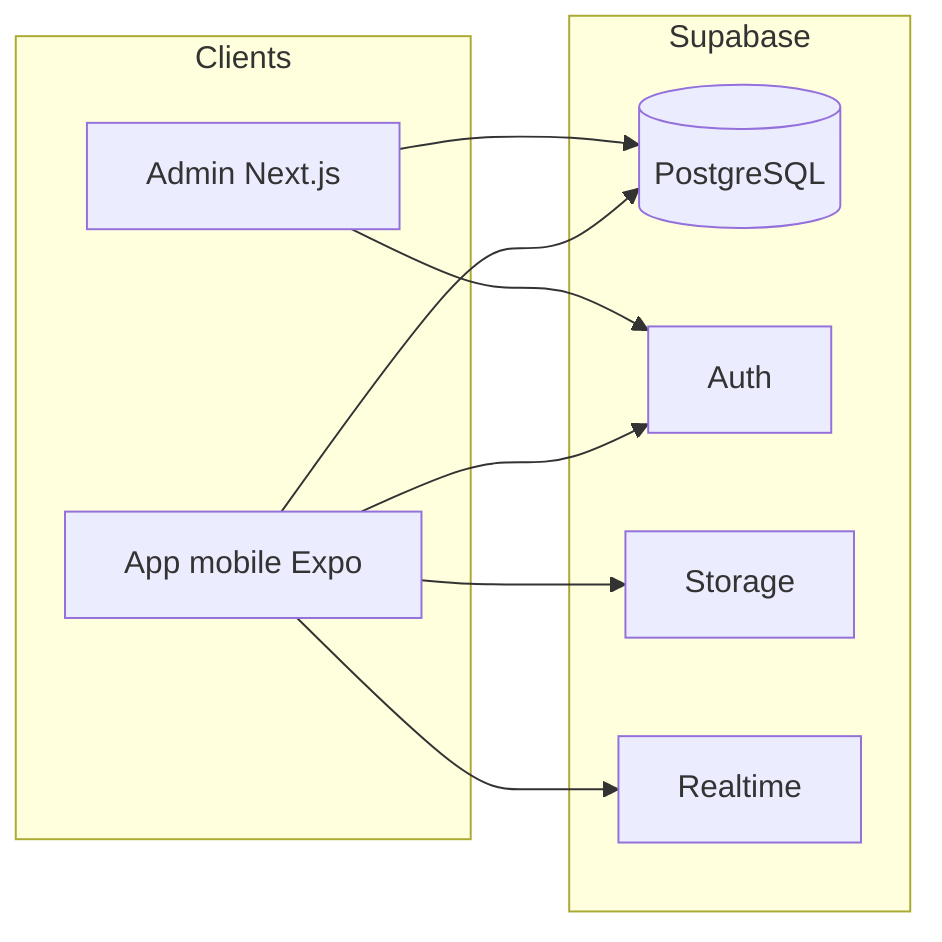

# Rapport de documentation — Projet GoFit

Document destiné à un rapport académique ou professionnel. Dernière mise à jour : mars 2026.

---

## 1. Présentation du projet

**GoFit** est une plateforme fitness complète composée de :

| Composant | Description |
|-----------|-------------|
| **Application mobile** | Application React Native (Expo) pour les clients et les coachs |
| **Panneau d’administration** | Application web Next.js pour la gestion du contenu et des utilisateurs |
| **Backend** | Supabase (PostgreSQL, Auth, Storage, Realtime) |

**Objectifs principaux :** suivi d’entraînements, bibliothèque d’exercices, programmes personnalisés, marketplace de coachs (Phase 5), réservations, messagerie, et (à terme) paiements et visioconférence.

---

## 2. Architecture technique



- **Mobile** : authentification utilisateur, lecture/écriture des données via clé **anon** (RLS).
- **Admin** : opérations sensibles via **service role** côté API routes (clé serveur, jamais exposée au navigateur).

---

## 3. Stack technique

### 3.1 Application mobile (`GoFitMobile/`)

| Catégorie | Technologies |
|-----------|----------------|
| Framework | **Expo SDK ~54**, React Native |
| Langage | **TypeScript** |
| Navigation | **React Navigation** (tabs + stacks) |
| État global | **Zustand** |
| Backend client | **@supabase/supabase-js** |
| Formulaires / validation | **react-hook-form**, **Zod** |
| Internationalisation | **i18next** / **react-i18next** (EN / FR) |
| UI | Composants React Native, **expo-linear-gradient**, **expo-image**, **lucide-react-native** |
| Graphiques | **react-native-chart-kit** |
| Notifications locales | **expo-notifications** |
| Médias | **expo-image-picker**, **expo-document-picker**, **expo-av** |
| Build | **expo-dev-client**, configuration **EAS** (`eas.json`) |

*(Le dépôt peut inclure des dépendances pour la visio, ex. LiveKit — intégration fonctionnelle selon avancement du projet.)*

### 3.2 Panneau admin (`admin-panel/`)

| Catégorie | Technologies |
|-----------|----------------|
| Framework | **Next.js 16** (App Router) |
| Langage | **TypeScript** |
| UI | **shadcn/ui**, **Tailwind CSS**, **Radix UI** |
| Tables / données | **@tanstack/react-table** |
| Auth / données | **@supabase/ssr**, **@supabase/supabase-js** |
| Stockage médias (optionnel) | **AWS SDK S3** (contenu workouts) |

### 3.3 Base de données (`database/`)

- Schémas SQL : `database/schema/`
- Migrations : `database/migrations/`
- Fonctions PostgreSQL : `database/functions/*.sql`
- Politiques Storage : `database/policies/`

Exécution typique : **éditeur SQL Supabase** ou pipeline de migration, dans l’ordre indiqué par `database/README.md`.

---

## 4. Structure du dépôt (monorepo)

```
GoFit/
├── GoFitMobile/          # Application mobile Expo
│   ├── App.tsx           # Point d’entrée, navigation racine (client / coach)
│   ├── src/
│   │   ├── api/          # Client API
│   │   ├── components/   # Composants réutilisables
│   │   ├── config/       # Supabase, etc.
│   │   ├── hooks/
│   │   ├── i18n/         # Traductions (en.json, fr.json)
│   │   ├── navigation/   # Navigateurs (Auth, App, Coach, Onboarding)
│   │   ├── screens/      # Écrans par domaine
│   │   ├── services/     # Accès données (Supabase)
│   │   ├── store/        # Stores Zustand
│   │   ├── theme/
│   │   └── types/
│   ├── assets/
│   └── docs/             # Documentation technique mobile
├── admin-panel/          # Next.js admin
│   ├── app/              # Routes App Router
│   ├── components/
│   ├── lib/
│   └── app/api/          # Routes API (service role)
├── database/             # SQL partagé mobile + admin
├── docs/                 # Documentation transverse (ce rapport, gantt, formulaire, etc.)
├── .cursor/plans/        # Plans de phases (non livrables obligatoires)
└── README.md             # Vue d’ensemble du repo
```

---

## 5. Application mobile — Fonctionnalités par domaine

### 5.1 Client (utilisateur `user_type: client`)

- **Authentification** : inscription, connexion, mot de passe oublié, OTP, réinitialisation.
- **Onboarding** : poids, taille, objectif, préférences.
- **Accueil** : stats, accès marketplace, raccourcis.
- **Entraînements** : planification, séances en cours, bibliothèque liée aux workouts.
- **Bibliothèque** : exercices, création / édition de workouts personnalisés, lancement de séance.
- **Progression** : statistiques, graphiques, constance, records.
- **Profil** : compte, objectifs, packs achetés, programmes coach, réservations, conversations, notifications (boîte de réception), thème, langue, etc.

### 5.2 Coach (utilisateur `user_type: coach`)

- **Flux dédié** : `CoachAuthNavigator`, onboarding coach (bio, spécialités, CV, certifications, statut pending/approved).
- **Onglets type coach** : tableau de bord, clients, calendrier / disponibilités, chat, profil (packs, programmes).
- **Fonctions** : liste clients, détail client, notes, progression client (RPC `get_client_progress`), programmes personnalisés, packs de séances, réservations.

### 5.3 Navigation racine

`App.tsx` / `RootNavigator` : selon session et `user_type`, affichage de l’app client, coach, ou des flux auth / onboarding correspondants.

### 5.4 Deep linking (aperçu)

Schéma type `gofit://` configuré pour ouvrir un profil coach (`coach/:coachId`) — détails dans `App.tsx` et la doc `expo-linking`.

---

## 6. Panneau d’administration — Pages principales

| Route | Rôle |
|-------|------|
| `/login` | Connexion admin |
| `/` ou `/dashboard` | Tableau de bord / analytics |
| `/users`, `/users/[id]` | Utilisateurs |
| `/exercises`, `/exercises/new`, `/exercises/[id]` | CRUD exercices |
| `/workouts`, `/workouts/new`, `/workouts/[id]` | CRUD workouts natifs / structure |
| `/coaches` | Vérification des profils et certifications coach |
| `/transactions` | Suivi des transactions (marketplace / paiements selon implémentation) |
| `/activity-logs` | Journal d’activité admin |
| `/settings` | Paramètres plateforme |

Documentation complémentaire dans `admin-panel/README.md`, `docs/admin-panel/`, et fichiers `*_FEATURES.md` du dossier admin.

---

## 7. Modèle de données (résumé)

### 7.1 Cœur fitness

- **`exercises`** : catalogue d’exercices.
- **`workouts`** : modèles natifs (`user_id` NULL) ou personnalisés (liés à un utilisateur).
- **`workout_exercises`** : liaison workout ↔ exercice (séries, reps, repos, snapshots).
- **`workout_sessions`** : journaux d’exécution (utilisateur, `workout_id`, dates, données de séance).

Détail : `database/DATABASE_STRUCTURE.md`.

### 7.2 Profils et auth

- **`user_profiles`** : données profil, `user_type` (client / coach), préférences, admin, etc.
- **`auth.users`** : utilisateurs Supabase Auth.

### 7.3 Phase 5 — Marketplace / coaching (schéma `create_coach_marketplace_tables.sql` et migrations associées)

Exemples de tables : `coach_profiles`, `coach_certifications`, `coach_reviews`, `coach_availability`, `session_packs`, `purchased_packs`, `bookings`, `custom_programs`, `conversations`, `messages`, `wallets`, `transactions`, `coach_client_notes`, `push_tokens`, notifications applicatives, etc.

Vues / fonctions utiles : `conversations_enriched`, `get_client_progress`, `get_coach_clients`, triggers sur avis coach, etc.

---

## 8. Sécurité

- **RLS (Row Level Security)** sur les tables exposées à l’API Supabase.
- Politiques différenciées : propriétaire des données, coach vs client, admins.
- **Storage** : buckets dédiés (ex. documents coach, médias chat) avec politiques dans `database/policies/`.
- Clé **service role** réservée au serveur (routes API admin), jamais dans l’app mobile.

---

## 9. Variables d’environnement

### Mobile (`GoFitMobile/.env`)

- `EXPO_PUBLIC_SUPABASE_URL`
- `EXPO_PUBLIC_SUPABASE_ANON_KEY`

### Admin (`admin-panel/.env.local`)

- `NEXT_PUBLIC_SUPABASE_URL`
- `NEXT_PUBLIC_SUPABASE_ANON_KEY`
- `SUPABASE_SERVICE_ROLE_KEY`

Voir aussi `admin-panel/ENV_SETUP.md`.

---

## 10. État d’avancement et périmètre « rapport »

À adapter selon votre soutenance :

| Domaine | Statut typique |
|---------|----------------|
| Auth, onboarding client | Réalisé |
| Workouts, séances, bibliothèque, progression | Réalisé |
| i18n EN/FR | Réalisé |
| Admin exercices / workouts / utilisateurs | Réalisé |
| Marketplace coach, chat, réservations, programmes | En grande partie réalisé (détail selon branche) |
| Paiements Stripe, wallet, webhooks | Souvent **planifié en dernier** |
| Visioconférence (LiveKit, etc.) | Selon intégration effective |
| Edge Functions Supabase | À documenter une fois déployées (`supabase/functions/` si utilisé) |

Pour un **rapport académique**, indiquez clairement ce qui est **démontrable** (captures, vidéo) vs **spécification / backlog**.

---

## 11. Documentation existante à citer dans le rapport

| Document | Contenu |
|----------|---------|
| `README.md` (racine) | Vue d’ensemble monorepo |
| `GoFitMobile/PROJECT_GUIDE.md` | Guide mobile |
| `database/DATABASE_STRUCTURE.md` | Modèle données fitness |
| `database/README.md` | Ordre des migrations |
| `docs/architecture/` | Décisions d’architecture |
| `docs/gantt/` | Planning type Scrum / Gantt |
| `docs/formulaire/` | Formulaires projet (FR) |
| `docs/admin-panel/` | Fonctionnalités admin |
| `.cursor/plans/gofit_phase_5_plan_*.plan.md` | Vision Phase 5 (référence planning) |

---

## 12. Commandes utiles (reproductibilité)

```bash
# Mobile
cd GoFitMobile
npm install
npx expo start

# Admin
cd admin-panel
npm install
npm run dev
```

---

## 13. Licence et confidentialité

Projet privé — adapter la mention selon votre institution.

---

*Ce document synthétise le dépôt ; en cas d’écart entre ce texte et le code, prévaloir le code et les migrations SQL effectives sur votre projet Supabase.*
