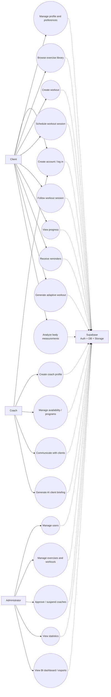
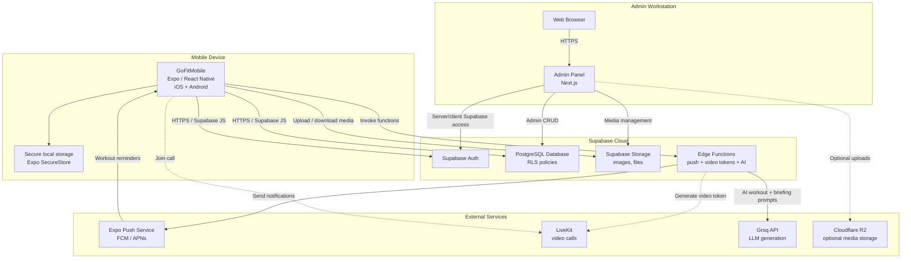
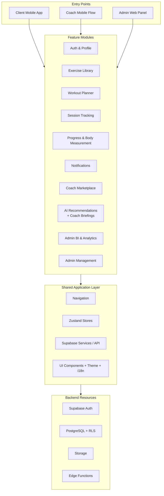
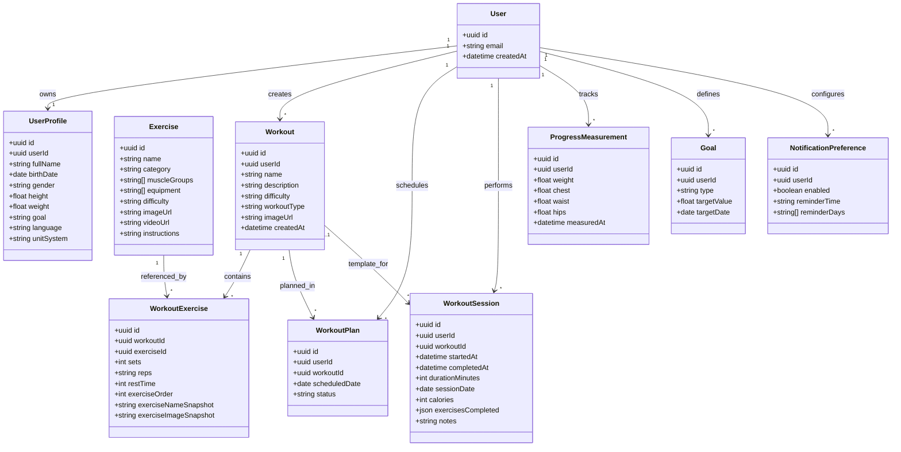
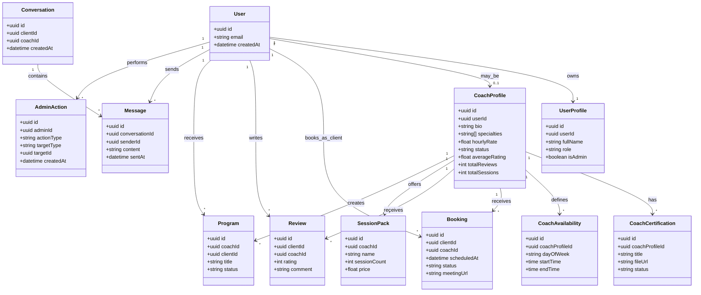

# First Restitution - GoFit Diagrams and Requirements

**Purpose:** slide-ready content for the first technical restitution.  
**Project:** GoFit - fitness mobile app, admin panel, and Supabase backend.

---

## Functional Requirements

| ID | Functional requirement | Main actor | Priority |
|---|---|---|---|
| FR01 | Allow a user to create an account, log in, log out, and reset their password. | Client / Coach | High |
| FR02 | Allow the user to complete and update their personal profile: basic information, goals, preferences, units, and language. | Client | High |
| FR03 | Display an exercise library with name, category, target muscles, difficulty, image, video, and instructions. | Client | High |
| FR04 | Allow search and filtering of exercises by category, equipment, muscle group, or level. | Client | Medium |
| FR05 | Allow the user to create a custom workout from the exercise library. | Client | High |
| FR06 | Allow configuration of sets, reps, rest time, and exercise order inside a workout. | Client | High |
| FR07 | Allow the user to start a workout session, follow exercises, manage the rest timer, and save the completed session. | Client | High |
| FR08 | Allow the user to schedule or consult workout sessions in a calendar. | Client | Medium |
| FR09 | Allow the user to track progress: workout history, weight, body measurements, and statistics. | Client | High |
| FR10 | Send workout reminders and notifications according to user preferences. | Client | Medium |
| FR11 | Allow a coach to create a profile, add specialties, CV, certifications, and availability information. | Coach | Medium |
| FR12 | Allow clients to view coach profiles and book sessions. | Client / Coach | Medium |
| FR13 | Allow the administrator to manage users, coaches, exercises, workouts, and platform content. | Administrator | High |
| FR14 | Allow the administrator to approve, suspend, or update coach accounts. | Administrator | High |
| FR15 | Secure access to data according to the user role: client, coach, or administrator. | System | High |
| FR16 | Generate adaptive AI workout recommendations from the user's goal, recent sessions, readiness data, health data, coach context, and the exercise database. | Client | Medium |
| FR17 | Generate AI pre-session briefings for coaches from a client's recent workouts and private coach notes, only when a coaching relationship exists. | Coach | Medium |
| FR18 | Provide BI dashboards and exports for administrators: growth, engagement, finance, coach operations, lifecycle, retention, and client health indicators. | Administrator | Medium |
| FR19 | Support body measurement analysis using photos, pose detection, segmentation, confidence indicators, and progress history. | Client | Medium |

---

## Non-Functional Requirements

| ID | Non-functional requirement | Description |
|---|---|---|
| NFR01 - Security | Accounts and personal data must be protected through Supabase Auth, secure sessions, and Row Level Security. |
| NFR02 - Privacy | A user must only access their own sessions, measurements, programs, and personal information. |
| NFR03 - Performance | Main screens must load quickly, especially the exercise library, workouts, and active workout session. |
| NFR04 - Reliability | Important actions such as creating a workout or saving a session must handle errors and avoid data loss. |
| NFR05 - Maintainability | The code must remain modular: screens, Supabase services, Zustand stores, UI components, and types are separated. |
| NFR06 - Compatibility | The mobile app must work on Android and iOS through Expo / React Native. The admin panel must work in modern browsers. |
| NFR07 - Usability | The interface must be easy to use during training: readable buttons, clear navigation, loading states, and error messages. |
| NFR08 - Scalability | The system must be able to evolve toward coaches, bookings, programs, notifications, and advanced features. |
| NFR09 - Internationalization | The application must support at least English and French. |
| NFR10 - Traceability | Sensitive admin actions and workout data must remain identifiable and consistent over time. |

---

## Use Case Diagram

**Short oral explanation:**  
The client mainly uses the mobile app to manage their profile, create workouts, follow sessions, view progress, analyze body measurements, and request adaptive workout recommendations. The coach has features related to their profile, clients, bookings, programs, communication, and AI client briefings. The administrator uses the web admin panel to manage the platform and consult BI dashboards. All data goes through Supabase, which handles authentication, database access, storage, Edge Functions, and security.

---

## Physical Architecture / Deployment Architecture

This diagram shows where the different parts of GoFit are deployed and how they communicate at runtime.

**Clean image for the presentation:** `docs/gofit_physical_architecture_slide.png`

**Short oral explanation:**  
The physical architecture is split into three main execution environments. The mobile app runs on the user's iOS or Android device and communicates with Supabase through HTTPS. The admin panel is accessed from a browser and uses the Next.js application to manage platform data. Supabase hosts authentication, PostgreSQL, storage, and Edge Functions. External services are used for push notifications, optional media storage, video calls, and the Groq LLM calls used by the current AI workout and AI briefing modules.

**Why this architecture is useful:**  
It keeps the mobile app light, centralizes sensitive data in Supabase, protects access through authentication and Row Level Security, and allows the platform to scale by adding services such as notifications, coach sessions, video calls, AI generation, and BI reporting without changing the whole architecture.

---

## Feature-Based Architecture

**Clean image for the presentation:** `docs/gofit_feature_based_architecture_slide.png`

The feature-based architecture explains how the application is organized internally. Instead of presenting only servers and devices, it shows the product modules and the shared technical layers used by those modules.

**Short oral explanation:**  
The feature-based architecture shows that GoFit is organized around business modules: authentication, exercise library, workout planner, session tracking, progress and body measurement, notifications, coach marketplace, AI recommendations, BI analytics, and administration. These modules share common technical layers such as navigation, state management, reusable UI components, services, and Supabase access. This structure makes the project easier to maintain because each feature has its own responsibility while still reusing shared infrastructure.

---

## Class Diagrams

### Class Diagram - Client Core, Workouts, and Progress

This is the most important technical diagram for the demo. It shows the core of GoFit: user profile, exercise library, workout creation, completed sessions, and progress tracking.

### Class Diagram - Coach, Bookings, and Administration

This second diagram completes the first one. It shows the platform extensions: coach profiles, certifications, bookings, reviews, messaging, programs, and administration.

**Short oral explanation:**  
I split the class diagram into two parts to avoid an overloaded view. The first diagram presents the GoFit business core: profile, exercises, workouts, sessions, and progress. The second diagram presents the platform extensions: coaches, bookings, programs, messaging, and administration. This separation makes the model easier to read while still covering the main classes of the project.

---

## Technical Points to Mention to the Expert

- Three-part architecture: Expo/React Native mobile app, Next.js admin panel, and Supabase backend.
- Authentication through Supabase Auth and data protection through Row Level Security.
- Normalized data model: separation between `Exercise`, `Workout`, `WorkoutExercise`, and `WorkoutSession`.
- Workout history is saved without duplicating exercise data unnecessarily.
- The app already includes foundations for coaches, marketplace, notifications, statistics, body measurements, AI recommendations, and admin BI.
- Code organization separates screens, components, services, stores, and types to improve maintainability.

---

## Current Implementation, Remaining Work, and Future Vision

### Already Implemented in the App

- **Adaptive AI workout recommendations:** the mobile home screen includes an `Adaptive AI` card. It calls the `ai-workout-recommendation` Supabase Edge Function, which uses Groq together with user profile data, recent workout sessions, readiness, health data, coach program context, active packs, and the exercise database.
- **AI coach briefing / session notes:** the coach client detail screen includes an AI briefing modal. It calls the `ai-session-notes` Supabase Edge Function, checks that the authenticated user is really the client's coach, then generates a concise briefing from recent sessions and private coach notes.
- **Advanced BI dashboard:** the admin dashboard already contains BI sections for finance, lifecycle, cohort retention, coach operations, and client health. It also includes CSV export links, saved BI views, BI snapshots, and scheduled digest routes.
- **Computer vision / body measurement foundation:** the mobile app contains a body measurement screen, pose/segmentation services, and a local MediaPipe module on Android. The current direction is to improve reliability and confidence before presenting it as a final production-grade measurement system.

### Remaining Work

- Polish and validate the already implemented modules: workout planner, exercise library, progress tracking, reminders, profile settings, coach marketplace, AI cards, and BI dashboard.
- Stabilize AI behavior before production: clearer loading/error states, generation limits, prompt safety, cache refresh rules, and final verification of deployed secrets such as `GROQ_API_KEY`.
- Improve the computer vision measurement flow: repeat tests on real devices, better confidence scoring, clearer retake guidance, and iOS parity for the MediaPipe bridge.
- Continue improving the admin BI layer: stronger filters, more reliable nutrition/body-measurement signals, better scheduled reports, and clearer operational alerts.
- Strengthen quality before deployment: real-device testing, performance optimization, bug fixing, security review, and final UI polishing.
- Prepare production deployment: Android build, iOS build, store assets, release configuration, and monitoring.

### Future Vision

The long-term vision of GoFit is to become a complete fitness platform connecting clients, coaches, training data, progress tracking, and intelligent recommendations. The goal is not only to record workouts, but to help users train consistently, understand their progress, and receive more personalized guidance over time.

### Future LLM / AI Extensions

The first LLM modules are already present in the app. The future vision is to make them more complete and safer without replacing the coach:

- **Workout assistant v2:** evolve the current adaptive workout generator into multi-day plans with equipment constraints, recovery awareness, and coach validation.
- **Coach assistant v2:** expand the current AI briefing into follow-up suggestions, session preparation, and progress summaries that the coach can edit.
- **Progress explanation:** explain progress trends in simple language, for example consistency, skipped sessions, or measurement evolution.
- **Support chatbot:** answer app usage questions and guide users through features.
- **Safety layer:** avoid medical diagnosis, keep recommendations general, and allow coach/user validation before applying changes.

### Future BI and Analytics Extensions

BI is already present in the admin panel. Future work should extend it into a stronger decision-support layer:

- Add more precise user segmentation for active users, retention, and workout consistency.
- Add deeper exercise and workout analysis: most used exercises, popular workout types, and drop-off points.
- Extend coach marketplace indicators: bookings, session packs, ratings, cancellations, no-shows, payout liability, and revenue.
- Monitor notification effectiveness: reminders sent, opened, and converted into completed sessions.
- Add automated BI digests and alerts that help administrators notice problems early.
